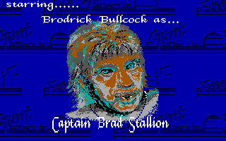
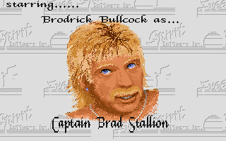

# Planet of Lust VGA Patch

This patch "upgrades" the EGA DOS port of [*Planet of Lust*](https://www.myabandonware.com/game/planet-of-lust-qg)
to VGA.

Compare EGA vs VGA (yes, that is a real screenshot):

  

## Building

0. Install dependencies: nasm, netpbm, xdftool (from [amitools](https://github.com/cnvogelg/amitools)), python3
1. Populate the `inputs` directory with files that match `MD5SUM`. You might find these on 
sites like archive.org or myabandonware.
2. Run `make.sh`

## How it works

The original DOS port of *Planet of Lust* created RLE-encoded EGA images using the default EGA palette. This
was not ideal for representing the... ahem... skin tones that were common in the game. In some cases the screens
look fine, but others look very far from ideal.

The Amiga version of the game contains full-color images, conveniently in 320x200 (which is the exact same
resolution as VGA's linear mode 13h). The palette for each image (plus the standard 16-color EGA palette)
are combined into a new VGA palette. The code for drawing images is replaced with a PCX decoder, but we also
add code for things like palette initialization.

For some unknown reason, the game hard-codes the expected sizes for each of the images it loads. We have
to patch all those out with our larger images. In addition, some of the new images would overflow the
available buffer size so that needs to be patched as well.

## Caveats

The patch attempts to reproduce what a VGA port _would_ have looked like. Because the VGA decoding is
actually faster than EGA decoding, the patch adds a short sleep after the title screen pops up so the
screen is visible.

This has currently been tested on DOSBox, but not real hardware. We're not doing anything too crazy with
VGA, so it's likely to work.

Don't expect pretty code. This code is _good enough_ to get things patched, but that's it. It's a hack
after all!
